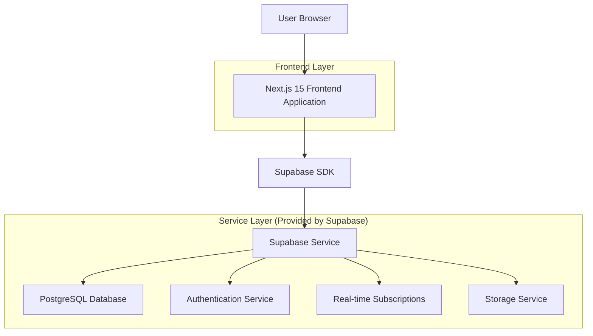
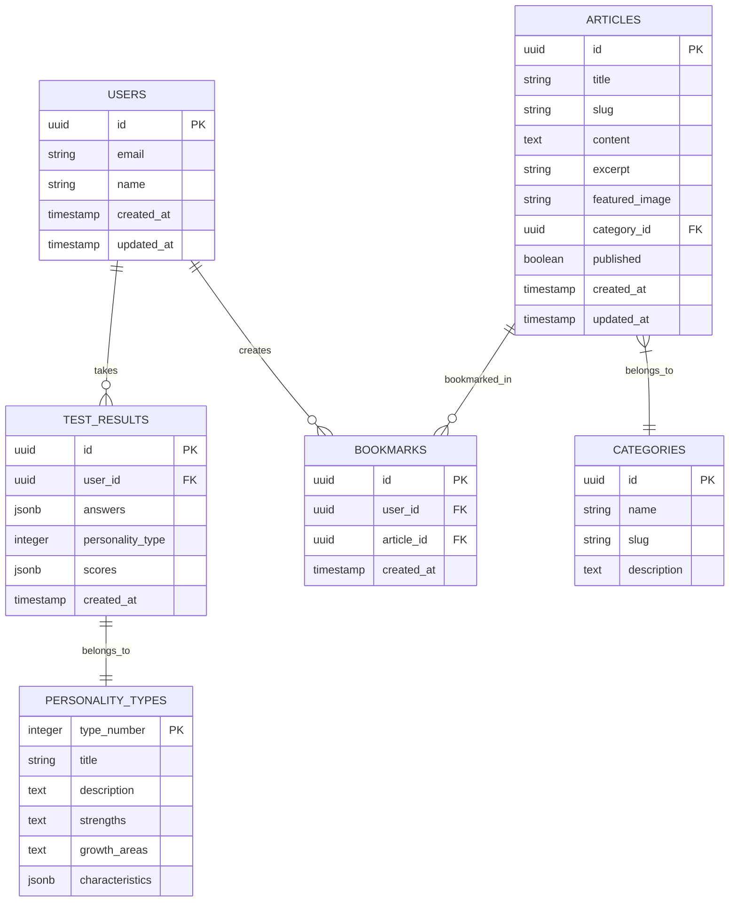

# Enneagram Test Website - Technical Architecture Document

## 1. Architecture Design



## 2. Technology Description
- Frontend: Next.js@15 + React@18 + TypeScript + Tailwind CSS@3 + Recharts (for radar charts)
- Backend: Supabase (PostgreSQL + Authentication + Real-time + Storage)
- Deployment: Vercel (Frontend) + Supabase Cloud (Backend services)

## 3. Route Definitions
| Route | Purpose |
|-------|---------|
| / | Homepage with hero section and test entry point |
| /test | Interactive Enneagram questionnaire page |
| /results/[id] | Test results page with radar chart and analysis |
| /articles | Articles listing page with search and filtering |
| /articles/[slug] | Individual article detail page |
| /dashboard | User dashboard for registered users |
| /auth/login | User login page |
| /auth/register | User registration page |
| /auth/callback | Supabase authentication callback |

## 4. API Definitions

### 4.1 Core API

**Test Management**
```
POST /api/test/submit
```

Request:
| Param Name | Param Type | isRequired | Description |
|------------|------------|------------|-------------|
| answers | number[] | true | Array of answer scores (1-5 scale) |
| user_id | string | false | User ID if authenticated |

Response:
| Param Name | Param Type | Description |
|------------|------------|-------------|
| test_id | string | Unique test result identifier |
| personality_type | string | Enneagram type (1-9) |
| scores | object | Detailed scores for each dimension |

Example:
```json
{
  "answers": [4, 3, 5, 2, 4, 3, 5, 1, 2, 4],
  "user_id": "uuid-string"
}
```

**Results Retrieval**
```
GET /api/results/[id]
```

Response:
| Param Name | Param Type | Description |
|------------|------------|-------------|
| personality_type | string | Enneagram type number |
| type_description | string | Detailed personality description |
| strengths | string[] | List of personality strengths |
| growth_areas | string[] | Areas for development |
| radar_data | object | Data for radar chart visualization |

**Articles Management**
```
GET /api/articles
```

Query Parameters:
| Param Name | Param Type | isRequired | Description |
|------------|------------|------------|-------------|
| page | number | false | Page number for pagination |
| category | string | false | Filter by article category |
| search | string | false | Search query string |

Response:
| Param Name | Param Type | Description |
|------------|------------|-------------|
| articles | array | List of article objects |
| total_count | number | Total number of articles |
| has_more | boolean | Whether more pages exist |

## 5. Data Model

### 5.1 Data Model Definition


### 5.2 Data Definition Language

**Users Table**
```sql
-- Create users table (handled by Supabase Auth)
CREATE TABLE profiles (
  id UUID REFERENCES auth.users(id) PRIMARY KEY,
  email VARCHAR(255) UNIQUE NOT NULL,
  name VARCHAR(100),
  created_at TIMESTAMP WITH TIME ZONE DEFAULT NOW(),
  updated_at TIMESTAMP WITH TIME ZONE DEFAULT NOW()
);

-- Enable RLS
ALTER TABLE profiles ENABLE ROW LEVEL SECURITY;

-- Create policies
CREATE POLICY "Users can view own profile" ON profiles
  FOR SELECT USING (auth.uid() = id);

CREATE POLICY "Users can update own profile" ON profiles
  FOR UPDATE USING (auth.uid() = id);

-- Grant permissions
GRANT SELECT ON profiles TO anon;
GRANT ALL PRIVILEGES ON profiles TO authenticated;
```

**Test Results Table**
```sql
CREATE TABLE test_results (
  id UUID PRIMARY KEY DEFAULT gen_random_uuid(),
  user_id UUID REFERENCES profiles(id),
  answers JSONB NOT NULL,
  personality_type INTEGER NOT NULL CHECK (personality_type >= 1 AND personality_type <= 9),
  scores JSONB NOT NULL,
  created_at TIMESTAMP WITH TIME ZONE DEFAULT NOW()
);

-- Create indexes
CREATE INDEX idx_test_results_user_id ON test_results(user_id);
CREATE INDEX idx_test_results_created_at ON test_results(created_at DESC);
CREATE INDEX idx_test_results_personality_type ON test_results(personality_type);

-- Enable RLS
ALTER TABLE test_results ENABLE ROW LEVEL SECURITY;

-- Create policies
CREATE POLICY "Anyone can create test results" ON test_results
  FOR INSERT WITH CHECK (true);

CREATE POLICY "Users can view own test results" ON test_results
  FOR SELECT USING (auth.uid() = user_id OR user_id IS NULL);

-- Grant permissions
GRANT SELECT, INSERT ON test_results TO anon;
GRANT ALL PRIVILEGES ON test_results TO authenticated;
```

**Personality Types Table**
```sql
CREATE TABLE personality_types (
  type_number INTEGER PRIMARY KEY CHECK (type_number >= 1 AND type_number <= 9),
  title VARCHAR(100) NOT NULL,
  description TEXT NOT NULL,
  strengths TEXT NOT NULL,
  growth_areas TEXT NOT NULL,
  characteristics JSONB NOT NULL
);

-- Insert initial data
INSERT INTO personality_types (type_number, title, description, strengths, growth_areas, characteristics) VALUES
(1, 'The Perfectionist', 'Principled, purposeful, self-controlled, and perfectionistic.', 'Organized, responsible, improvement-oriented', 'Flexibility, self-acceptance, patience', '{"core_motivation": "To be good and right", "basic_fear": "Being corrupt or defective"}'),
(2, 'The Helper', 'Generous, demonstrative, people-pleasing, and possessive.', 'Caring, interpersonal, generous', 'Self-care, boundaries, authenticity', '{"core_motivation": "To be loved", "basic_fear": "Being unloved or unwanted"}'),
(3, 'The Achiever', 'Adaptable, excelling, driven, and image-conscious.', 'Ambitious, competent, energetic', 'Authenticity, work-life balance, vulnerability', '{"core_motivation": "To be worthwhile", "basic_fear": "Being worthless or without value"}');
-- Continue for types 4-9...

-- Grant permissions
GRANT SELECT ON personality_types TO anon;
GRANT ALL PRIVILEGES ON personality_types TO authenticated;
```

**Articles and Categories Tables**
```sql
CREATE TABLE categories (
  id UUID PRIMARY KEY DEFAULT gen_random_uuid(),
  name VARCHAR(100) NOT NULL,
  slug VARCHAR(100) UNIQUE NOT NULL,
  description TEXT
);

CREATE TABLE articles (
  id UUID PRIMARY KEY DEFAULT gen_random_uuid(),
  title VARCHAR(200) NOT NULL,
  slug VARCHAR(200) UNIQUE NOT NULL,
  content TEXT NOT NULL,
  excerpt TEXT,
  featured_image VARCHAR(500),
  category_id UUID REFERENCES categories(id),
  published BOOLEAN DEFAULT false,
  created_at TIMESTAMP WITH TIME ZONE DEFAULT NOW(),
  updated_at TIMESTAMP WITH TIME ZONE DEFAULT NOW()
);

-- Create indexes
CREATE INDEX idx_articles_published ON articles(published);
CREATE INDEX idx_articles_category_id ON articles(category_id);
CREATE INDEX idx_articles_created_at ON articles(created_at DESC);

-- Grant permissions
GRANT SELECT ON categories TO anon;
GRANT SELECT ON articles TO anon;
GRANT ALL PRIVILEGES ON categories TO authenticated;
GRANT ALL PRIVILEGES ON articles TO authenticated;
```

**Bookmarks Table**
```sql
CREATE TABLE bookmarks (
  id UUID PRIMARY KEY DEFAULT gen_random_uuid(),
  user_id UUID REFERENCES profiles(id) NOT NULL,
  article_id UUID REFERENCES articles(id) NOT NULL,
  created_at TIMESTAMP WITH TIME ZONE DEFAULT NOW(),
  UNIQUE(user_id, article_id)
);

-- Enable RLS
ALTER TABLE bookmarks ENABLE ROW LEVEL SECURITY;

-- Create policies
CREATE POLICY "Users can manage own bookmarks" ON bookmarks
  USING (auth.uid() = user_id);

-- Grant permissions
GRANT ALL PRIVILEGES ON bookmarks TO authenticated;
```