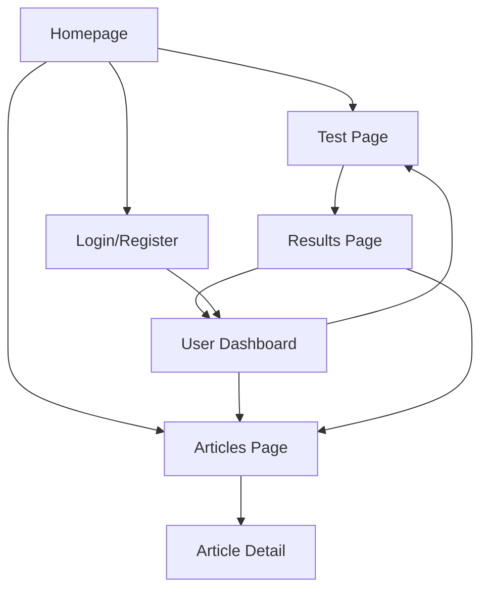

# Enneagram Test Website - Product Requirements Document

## 1. Product Overview
An English-language Enneagram personality test website that provides users with professional psychological assessment tools to discover their personality type through interactive questionnaires and receive detailed results with visual charts.

The website serves individuals seeking self-understanding and personal development, offering a user-friendly testing experience with professional psychological insights and comprehensive personality analysis.

## 2. Core Features

### 2.1 User Roles
| Role | Registration Method | Core Permissions |
|------|---------------------|------------------|
| Anonymous User | No registration required | Can take tests, view basic results |
| Registered User | Email registration | Can save test history, access detailed reports, bookmark articles |

### 2.2 Feature Module
Our Enneagram test website consists of the following main pages:
1. **Homepage**: hero section with test introduction, prominent test entry button, navigation menu, featured articles preview.
2. **Test Page**: interactive questionnaire with progress indicator, personalized guidance, step-by-step questions.
3. **Results Page**: radar chart visualization, detailed personality analysis, downloadable report, related articles.
4. **Articles Page**: psychology articles list, search and filter functionality, category navigation.
5. **Article Detail Page**: full article content, related articles, social sharing options.
6. **User Dashboard**: test history, saved results, profile management (for registered users).

### 2.3 Page Details
| Page Name | Module Name | Feature description |
|-----------|-------------|---------------------|
| Homepage | Hero Section | Display compelling introduction to Enneagram testing with clear value proposition and prominent CTA button |
| Homepage | Navigation Menu | Provide easy access to all main sections including test, articles, and user account |
| Homepage | Featured Articles | Showcase 3-4 popular psychology articles with thumbnails and brief descriptions |
| Homepage | Footer | Include contact information, privacy policy, and social media links |
| Test Page | Question Interface | Present questions one by one with clear formatting, multiple choice options, and progress tracking |
| Test Page | Progress Indicator | Show completion percentage and estimated time remaining |
| Test Page | Personalized Guidance | Provide contextual tips and explanations to help users understand questions |
| Results Page | Radar Chart | Generate interactive radar chart showing personality dimensions with scores |
| Results Page | Personality Analysis | Display detailed description of user's Enneagram type with strengths and growth areas |
| Results Page | Report Download | Allow users to download PDF report of their results |
| Results Page | Related Content | Suggest relevant articles and resources based on personality type |
| Articles Page | Article List | Display paginated list of psychology articles with thumbnails, titles, and excerpts |
| Articles Page | Search & Filter | Enable users to search by keywords and filter by categories or tags |
| Articles Page | Category Navigation | Provide sidebar navigation for different psychology topics |
| Article Detail | Content Display | Show full article with proper typography, images, and formatting |
| Article Detail | Related Articles | Suggest 3-4 related articles at the bottom of the page |
| Article Detail | Social Sharing | Include buttons for sharing on social media platforms |
| User Dashboard | Test History | Display list of previous tests with dates and quick access to results |
| User Dashboard | Profile Management | Allow users to update personal information and preferences |
| User Dashboard | Saved Content | Show bookmarked articles and saved test results |

## 3. Core Process
**Anonymous User Flow:**
Users visit the homepage, click the test button, complete the interactive questionnaire with guided assistance, receive immediate results with radar chart visualization, and can optionally register to save results.

**Registered User Flow:**
Users log in, access their dashboard to view test history, take new tests or retake previous ones, save and download detailed reports, browse and bookmark articles, and manage their profile settings.

## 4. User Interface Design
### 4.1 Design Style
- **Primary Color**: Deep Blue (#1E3A8A) for headers, navigation, and primary buttons
- **Secondary Color**: Sky Blue (#3B82F6) for links, secondary buttons, and accents
- **Background Colors**: Light Gray (#F9FAFB) for page backgrounds, White (#FFFFFF) for content areas
- **Accent Color**: Orange (#F97316) for call-to-action buttons, highlights, and result emphasis
- **Typography**: Clean sans-serif fonts (Inter or similar) with 16px base size, 24px for headings
- **Button Style**: Rounded corners (8px radius), subtle shadows, hover animations
- **Layout Style**: Card-based design with generous white space, top navigation bar
- **Icons**: Simple line icons with consistent stroke width, psychology-themed symbols

### 4.2 Page Design Overview
| Page Name | Module Name | UI Elements |
|-----------|-------------|-------------|
| Homepage | Hero Section | Large background image, centered text overlay, prominent orange CTA button, clean typography |
| Homepage | Navigation | Horizontal menu bar with deep blue background, white text, hover effects |
| Homepage | Featured Articles | Card layout with image thumbnails, sky blue accent borders, clean spacing |
| Test Page | Question Interface | Centered card design, large readable text, radio button styling, progress bar in sky blue |
| Test Page | Progress Indicator | Linear progress bar with orange fill, percentage display, estimated time |
| Results Page | Radar Chart | Interactive chart with deep blue data points, light gray grid, responsive design |
| Results Page | Analysis Section | White background cards with subtle shadows, organized typography, orange highlights |
| Articles Page | Article Grid | Responsive card layout, hover effects, consistent image aspect ratios |
| Articles Page | Sidebar | Light gray background, organized category links, search input with sky blue focus |
| User Dashboard | Navigation Tabs | Horizontal tab design with active state in deep blue, clean transitions |

### 4.3 Responsiveness
The website is designed mobile-first with responsive breakpoints at 768px (tablet) and 1024px (desktop). Touch-friendly interactions are optimized for mobile devices, including larger tap targets and swipe gestures for test navigation.